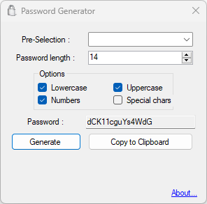

## Project

As its name suggests, PasswordGenerator is an application designed to generate random and customizable (in terms of lengths and authorized characters) passwords.

## Environement

This project is developped in C# (.NET Framework 4.7.2) and using native Windows Forms for the GUI.

## Screenshots

